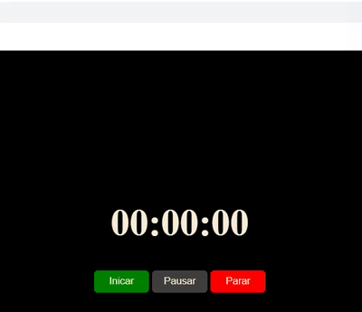

<h1> Timer </h1>

&#160;&#160;
&#160;&#160;
&#160;&#160;

 
 <h3>Descrição:</h3>

A base de um cronômetro feito em JavaScript.

   

- [Acesse o projeto finalizado, online](https://lucasbizachi.github.io/Timer/
)
